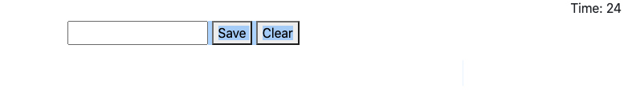

# code-quiz
Here I have created a Game of Thrones timed quiz. The user has 10 seconds per question to answer and there are a total of 9 questions. An incorrect message will dock 10 seconds off the timer.

When the game concludes the user is given a box to enter initals to save to local stoarage for later access.

User is then taken to highscore page to see results.

Link to quiz: https://eriklowrance.github.io/code-quiz/